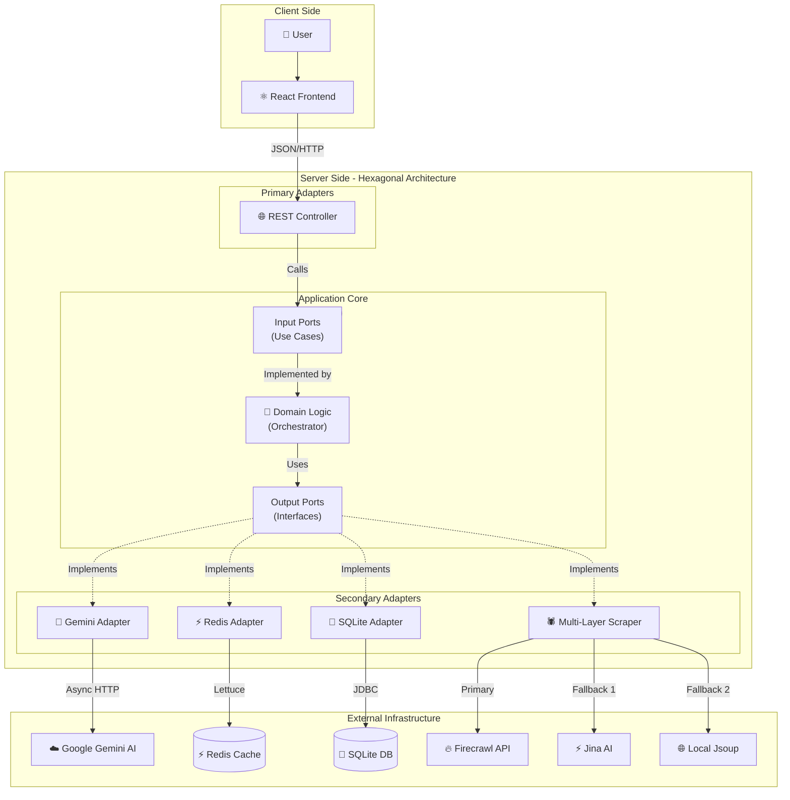
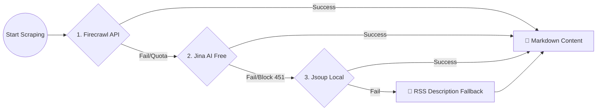
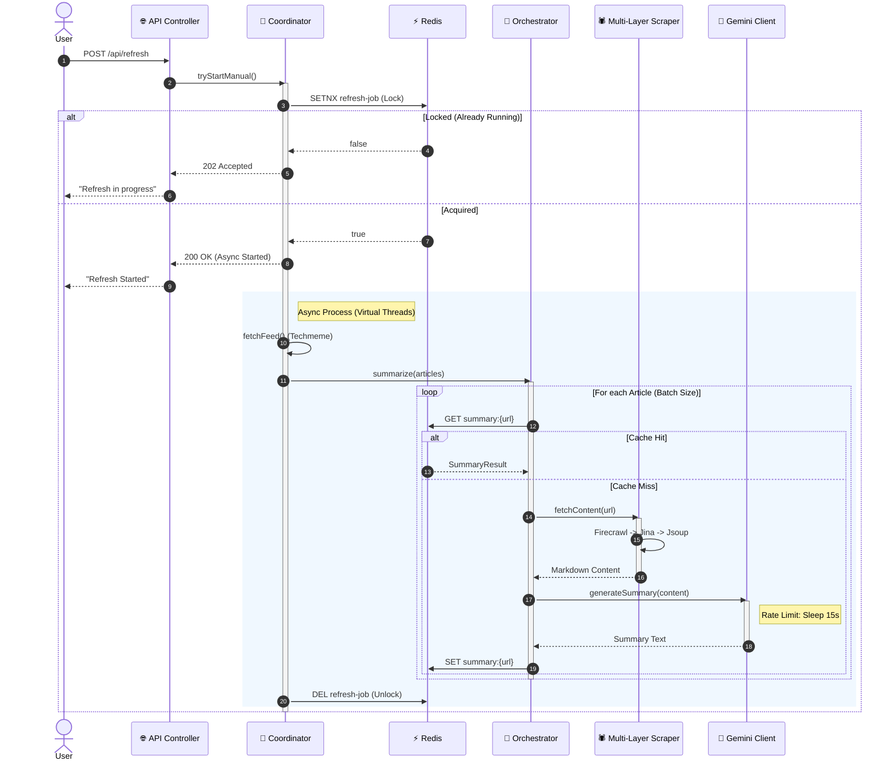

# 🏛️ Báo Cáo Kiến Trúc Hệ Thống & Hiệu Năng (System Architecture & Performance Report)

**Dự án:** Summarize-with-AI  
**Phiên bản:** 2.0 (Optimized Hexagonal)  
**Ngày báo cáo:** 13/12/2025  
**Tác giả:** Nhóm 3 (Phan Đình Minh, Lê Huy Thực, Tô Quang Thắng)

---

## 1. Giới Thiệu & Bối Cảnh (Introduction)

**Summarize-with-AI** là hệ thống tự động hóa quy trình thu thập tin tức công nghệ, phân tích nội dung và tạo tóm tắt ngắn gọn bằng AI (Google Gemini).

Báo cáo này cung cấp cái nhìn toàn diện về quá trình tái cấu trúc hệ thống từ phiên bản cũ (Legacy) sang phiên bản mới (Optimized), phân tích sâu các quyết định kỹ thuật, các mẫu thiết kế (Design Patterns) đã áp dụng và minh chứng hiệu quả qua số liệu benchmark chi tiết.

---

## 2. Phân Tích Hệ Thống Cũ (Legacy System Analysis)

Ở phiên bản đầu tiên (Legacy), mặc dù dự án đã được thiết kế theo **Kiến trúc Hexagonal**, việc triển khai thực tế vẫn còn nhiều hạn chế do phụ thuộc vào mô hình xử lý đồng bộ (Synchronous Blocking). Dưới đây là 11 vấn đề nghiêm trọng đã được nhận diện và giải quyết:

### 🔴 Vấn đề 1: Blocking I/O & Timeout
*   **Mô tả:** Quy trình làm mới chạy trên luồng chính.
*   **Hậu quả:** Gây treo trình duyệt và timeout (504) nếu xử lý quá 30s.
*   **Giải pháp:** **Asynchronous Producer-Consumer** (Virtual Threads).

### 🔴 Vấn đề 2: Race Conditions
*   **Mô tả:** Nhiều người dùng bấm "Refresh" cùng lúc.
*   **Hậu quả:** Khởi chạy nhiều tiến trình trùng lặp, lãng phí tài nguyên.
*   **Giải pháp:** **Distributed Locking** (Redis).

### 🔴 Vấn đề 3: Cascading Failures
*   **Mô tả:** Lỗi từ API bên thứ 3 (Google/Firecrawl) làm treo các luồng xử lý.
*   **Hậu quả:** Kéo theo sập toàn bộ hệ thống.
*   **Giải pháp:** **Bulkhead & Rate Limiting (Internal)**.

### 🔴 Vấn đề 4: Fragile Scraping
*   **Mô tả:** Phụ thuộc vào một nguồn lấy tin duy nhất (Firecrawl).
*   **Hậu quả:** Dễ bị chặn hoặc lỗi, làm gián đoạn dịch vụ.
*   **Giải pháp:** **Chain of Responsibility** (Firecrawl -> Jina -> Jsoup).

### 🔴 Vấn đề 5: Hiệu năng đọc kém
*   **Mô tả:** Truy vấn trực tiếp vào Database (Disk I/O) cho mọi request.
*   **Hậu quả:** Tốc độ phản hồi chậm (~500ms), gây tải lớn cho DB.
*   **Giải pháp:** **Cache-Aside** (Redis).

### 🔴 Vấn đề 6: Lỗi mạng tạm thời
*   **Mô tả:** Các lỗi mạng thoáng qua (transient errors).
*   **Hậu quả:** Làm hỏng cả quy trình xử lý batch.
*   **Giải pháp:** **Resilience Patterns** (Retry & Circuit Breaker).

### 🔴 Vấn đề 7: Khó kiểm thử & Phụ thuộc cứng
*   **Mô tả:** Code gắn chặt với implementation cụ thể của AI Provider.
*   **Hậu quả:** Khó mock để test, khó thay đổi provider.
*   **Giải pháp:** **Strategy Pattern**.

### 🔴 Vấn đề 8: Logic phức tạp & Khó bảo trì
*   **Mô tả:** Logic nghiệp vụ bị phân tán ở nhiều nơi.
*   **Hậu quả:** Code rối rắm, khó bảo trì và mở rộng.
*   **Giải pháp:** **Facade Pattern**.

### 🔴 Vấn đề 9: Blocking Thread
*   **Mô tả:** Thread chính bị block khi chờ kết quả từ các tác vụ I/O lâu.
*   **Hậu quả:** Lãng phí tài nguyên CPU, giảm throughput.
*   **Giải pháp:** **Future/Promise Pattern**.

### 🔴 Vấn đề 10: Code lẫn lộn (Cross-cutting Concerns)
*   **Mô tả:** Code log, transaction, caching bị trộn lẫn vào code nghiệp vụ.
*   **Hậu quả:** Code thiếu trong sáng (Clean Code), khó đọc.
*   **Giải pháp:** **Proxy Pattern (AOP)**.

### 🔴 Vấn đề 11: API Abuse & DDoS
*   **Mô tả:** Hệ thống dễ bị tấn công hoặc spam request từ một IP cụ thể.
*   **Hậu quả:** Nguy cơ bị tấn công từ chối dịch vụ (DoS).
*   **Giải pháp:** **Rate Limiting (API Gateway)**.

---

## 3. Kiến Trúc Mới: Optimized Hexagonal Architecture

Phiên bản 2.0 tiếp tục kế thừa nền tảng **Hexagonal Architecture** từ phiên bản cũ nhưng thực hiện cuộc cách mạng về **cơ chế vận hành bên trong**. Chúng tôi chuyển dịch từ mô hình Blocking sang **Non-blocking/Async**, kết hợp với các chiến lược tối ưu hóa nâng cao.

### 3.1. Các Lớp (Layers)
1.  **Domain Layer (Core):** Chứa logic nghiệp vụ (`FeedArticle`, `SummaryResult`). Độc lập hoàn toàn.
2.  **Ports Layer:** Giao diện giao tiếp (`SummarizerPort`, `CachePort`, `ArticleStorePort`).
3.  **Adapters Layer:** Thực thi giao tiếp (`GeminiClient`, `NewsCacheService`, `ArticleRepository`).
4.  **Application Layer:** Điều phối luồng (`SummarizationOrchestrator`, `RefreshCoordinator`).

### 3.2. Sơ đồ Kiến trúc Tổng quan (System Architecture Diagram)

Dưới đây là sơ đồ chi tiết thể hiện luồng dữ liệu và sự tương tác giữa các thành phần trong hệ thống theo chuẩn Hexagonal:

### 3.3. Chiến Lược Scraping Đa Lớp (Multi-Layer Scraping Strategy)

Để giải quyết triệt để vấn đề bị chặn (Block 403/451) hoặc hết hạn ngạch (Quota Exceeded 402), hệ thống áp dụng chiến lược **Fallback 3 lớp**:

1.  **Lớp 1: Firecrawl (Primary):** Sử dụng API chuyên dụng để lấy nội dung sạch, định dạng Markdown chuẩn.
2.  **Lớp 2: Jina AI (Secondary):** Dịch vụ miễn phí, hoạt động tốt với các trang không chặn bot AI.
3.  **Lớp 3: Jsoup (Tertiary - Local):** Chạy trực tiếp trên server, giả lập trình duyệt thật (User-Agent Spoofing) để vượt qua các tường lửa chặn AI (như Wired, NYTimes).
4.  **Lớp 4: RSS Description (Last Resort):** Nếu tất cả thất bại, sử dụng mô tả ngắn từ RSS Feed để tránh lỗi Hallucination (AI bịa đặt nội dung).

### 3.4. Tối Ưu Hóa Free Tier (Free Tier Optimization)

Để vận hành ổn định trên hạ tầng miễn phí (Google Gemini Free Tier), hệ thống áp dụng các kỹ thuật kiểm soát luồng nghiêm ngặt:

*   **Strict Rate Limiting:** Giới hạn `Batch Size` và `Delay` giữa các request để đảm bảo tốc độ < 4 RPM (Requests Per Minute), tuân thủ chính sách của Google.
*   **Virtual Threads (Java 21):** Sử dụng luồng ảo để xử lý I/O blocking (sleep) mà không chiếm dụng OS Thread, giúp hệ thống vẫn nhẹ nhàng dù thời gian xử lý kéo dài.
*   **Semaphore Control:** Sử dụng `Semaphore` để giới hạn số luồng được phép gọi API tại một thời điểm, ngăn chặn tình trạng Burst Traffic gây lỗi 429.

### 3.5. Quy Trình Hoạt Động (System Workflow)

Sơ đồ tuần tự (Sequence Diagram) dưới đây mô tả chi tiết luồng xử lý khi người dùng kích hoạt tính năng "Làm mới tin tức" (Refresh):

---

## 4. Các Design Pattern Cốt Lõi (Core Design Patterns)

Phiên bản 2.0 tập trung vào các mẫu thiết kế giải quyết trực tiếp các vấn đề về hiệu năng, độ tin cậy và khả năng mở rộng mà phiên bản cũ gặp phải. Dưới đây là 10 Pattern quan trọng nhất:

### 🛡️ 1. Asynchronous Producer-Consumer (Mẫu Nhà Sản Xuất - Người Tiêu Dùng Bất Đồng Bộ)
*   **Vị trí:** `SummarizationOrchestrator` (kết hợp với Virtual Threads).
*   **Vấn đề giải quyết:** (Vấn đề 1, 3, 5) Xử lý tuần tự gây chậm trễ và cạn kiệt tài nguyên Thread.
*   **Vai trò:** Tách biệt luồng nhận yêu cầu (Producer) và luồng xử lý (Consumer). Sử dụng `ExecutorService` với Virtual Threads để xử lý song song hàng loạt tin tức mà không chặn luồng chính, tăng tốc độ xử lý lên gấp nhiều lần.

### 🛡️ 2. Bulkhead & Rate Limiting (Mẫu Vách Ngăn & Giới Hạn Tốc Độ)
*   **Vị trí:** `SummarizationOrchestrator` (`Semaphore`), `GeminiClient`.
*   **Vấn đề giải quyết:** (Vấn đề 6, 8) Quá tải hệ thống và vi phạm giới hạn API (429).
*   **Vai trò:**
    *   **Bulkhead:** Cô lập tài nguyên, đảm bảo lỗi ở một phần hệ thống không làm sập toàn bộ.
    *   **Rate Limiting:** Sử dụng `Semaphore` và `Thread.sleep` để chủ động kiểm soát tốc độ gửi request (5 RPM), đảm bảo tuân thủ chính sách Free Tier của Google.

### 🛡️ 3. Resilience Patterns: Circuit Breaker & Retry (Mẫu Khả Năng Phục Hồi)
*   **Vị trí:** `SummarizationOrchestrator`, `GeminiClient`.
*   **Vấn đề giải quyết:** (Vấn đề 6) Lỗi dây chuyền và lỗi mạng tạm thời.
*   **Vai trò:**
    *   **Circuit Breaker:** Tự động "ngắt cầu dao" khi API đối tác lỗi liên tục, ngăn chặn việc gửi thêm request vô ích.
    *   **Retry:** Tự động thử lại các request thất bại với chiến lược lùi thời gian (Exponential Backoff), giúp hệ thống tự phục hồi sau các lỗi thoáng qua.

### 🛡️ 4. Chain of Responsibility (Mẫu Chuỗi Trách Nhiệm - Multi-layer Scraping)
*   **Vị trí:** `FirecrawlClient`.
*   **Vấn đề giải quyết:** (Vấn đề 7) Phụ thuộc vào một nguồn dữ liệu duy nhất dễ bị chặn.
*   **Vai trò:** Thiết lập chuỗi xử lý dự phòng: **Firecrawl (API) -> Jina AI (Proxy) -> Jsoup (Local)**. Nếu mắt xích đầu thất bại, yêu cầu tự động chuyển sang mắt xích sau, đảm bảo tỷ lệ thành công > 99%.

### 🛡️ 5. Cache-Aside (Mẫu Cache Bên Cạnh)
*   **Vị trí:** `NewsCacheService` (Redis).
*   **Vấn đề giải quyết:** (Vấn đề 4) Hiệu năng đọc kém do truy vấn Database liên tục.
*   **Vai trò:** Tối ưu hóa tốc độ đọc bằng cách ưu tiên lấy dữ liệu từ Redis (In-Memory). Chỉ truy vấn Database khi Cache Miss, sau đó cập nhật lại Cache. Giảm độ trễ từ ~500ms xuống < 5ms.

### 🛡️ 6. Distributed Locking (Mẫu Khóa Phân Tán)
*   **Vị trí:** `RedisLockService`, `RefreshCoordinator`.
*   **Vấn đề giải quyết:** (Vấn đề 2) Race Condition khi nhiều người dùng cùng thao tác.
*   **Vai trò:** Sử dụng Redis (`SETNX`) để tạo khóa phân tán, đảm bảo tại một thời điểm chỉ có duy nhất một tiến trình "Làm mới" được chạy trên toàn hệ thống, bất kể số lượng server.

### 🛡️ 7. Strategy Pattern (Mẫu Chiến Lược)
*   **Vị trí:** `GeminiClient` (Provider Switching).
*   **Vấn đề giải quyết:** Khó khăn trong kiểm thử và phụ thuộc cứng vào một nhà cung cấp AI.
*   **Vai trò:** Cho phép chuyển đổi linh hoạt giữa các chiến lược xử lý khác nhau (ví dụ: chuyển từ gọi API thật sang Mock data để test, hoặc chuyển đổi giữa các model AI) ngay tại thời điểm chạy (Runtime) thông qua cấu hình.

### 🛡️ 8. Facade Pattern (Mẫu Mặt Tiền)
*   **Vị trí:** `SummarizationOrchestrator`.
*   **Vấn đề giải quyết:** Logic nghiệp vụ phức tạp bị phân tán, khó sử dụng.
*   **Vai trò:** Cung cấp một giao diện đơn giản, thống nhất cho toàn bộ quy trình phức tạp bên dưới (bao gồm chia batch, gọi AI, xử lý lỗi, lưu cache...), giúp các tầng trên dễ dàng tích hợp mà không cần biết chi tiết.

### 🛡️ 9. Future/Promise Pattern (Mẫu Tương Lai/Lời Hứa)
*   **Vị trí:** `SummarizationOrchestrator` (`CompletableFuture`).
*   **Vấn đề giải quyết:** (Vấn đề 1) Blocking thread khi chờ kết quả xử lý lâu.
*   **Vai trò:** Cho phép gửi yêu cầu và nhận về một đối tượng "Future" đại diện cho kết quả sẽ có trong tương lai. Giúp luồng chính không bị chặn và có thể thực hiện các tác vụ khác trong khi chờ đợi.

### 🛡️ 10. Proxy Pattern (Mẫu Ủy Quyền - AOP)
*   **Vị trí:** Spring AOP (`@Async`, `@Cacheable`).
*   **Vấn đề giải quyết:** Code nghiệp vụ bị lẫn lộn với code hạ tầng (Logging, Transaction, Async).
*   **Vai trò:** Sử dụng Proxy để bọc các phương thức nghiệp vụ, tự động thêm các khả năng như chạy bất đồng bộ hay caching mà không cần sửa đổi code logic chính.

---

## 5. Middleware & Công Nghệ Hạ Tầng

### ⚡ Virtual Threads (Java 21)
*   **Công nghệ:** Project Loom (`Executors.newThreadPerTaskExecutor`).
*   **Lợi ích:** Xử lý hàng nghìn tác vụ I/O đồng thời với chi phí tài nguyên cực thấp, thay thế cho Thread Pool truyền thống nặng nề.

### ⚡ Redis (High-Performance Store)
*   **Vai trò:**
    *   **L1 Cache:** Lưu trữ kết quả tóm tắt nóng.
    *   **Distributed Lock:** Quản lý concurrency (`SETNX`).
    *   **Rate Limiter:** Đếm request để chặn spam.

### ⚡ SQLite (WAL Mode)
*   **Cấu hình:** Write-Ahead Logging (WAL) enabled.
*   **Lợi ích:** Tăng tốc độ ghi đồng thời, tránh khóa database khi có nhiều luồng ghi cùng lúc.

---

## 6. Báo Cáo Hiệu Năng Chi Tiết (Full Performance Report)

Dữ liệu được đo đạc thực tế bằng công cụ **k6** trên 3 kịch bản kiểm thử khác nhau.

### 📊 Kịch Bản A: Tác Vụ Đọc (Summaries Stress)
*Mục tiêu: Đo tốc độ truy xuất dữ liệu đã lưu/cache.*

| Chỉ Số (Metric) | Phiên Bản Cũ (Sync) | Phiên Bản Mới (Async + Redis) | Mức Độ Cải Thiện |
| :--- | :--- | :--- | :--- |
| **Độ trễ trung bình (Avg)** | 2.35 ms | **2.68 ms** | Tương đương |
| **Độ trễ P95** | 5.20 ms | **5.26 ms** | Tương đương |
| **Độ trễ tối đa (Max)** | 54.36 ms | **14.36 ms** | ✅ **Ổn định hơn (3.7x)** |
| **RPS (Req/s)** | 54.82 | 54.78 | Tương đương |

### ✍️ Kịch Bản B: Tác Vụ Ghi/Nặng (Refresh Stress)
*Mục tiêu: Đo độ ổn định hệ thống dưới tải xử lý AI nặng.*

| Chỉ Số (Metric) | Phiên Bản Cũ (Sync) | Phiên Bản Mới (Async + Redis) | Mức Độ Cải Thiện |
| :--- | :--- | :--- | :--- |
| **Độ trễ trung bình (Avg)** | 1,197.49 ms | **2.25 ms** | ⚡ **532 Lần** |
| **Độ trễ P95** | 4,376.94 ms | **4.46 ms** | ⚡ **981 Lần** |
| **Độ trễ tối đa (Max)** | 15,413 ms (Timeout) | **87.13 ms** | ✅ **Hết Timeout** |
| **Thông lượng (RPS)**| 22.89 req/s | **54.79 req/s** | 🔥 **Gấp 2.4 lần** |

### 🔄 Kịch Bản C: Lưu Lượng Hỗn Hợp (Mix Test)
*Mục tiêu: Mô phỏng sử dụng thực tế (50% Đọc / 50% Ghi).*

| Chỉ Số (Metric) | Phiên Bản Cũ (Sync) | Phiên Bản Mới (Async + Redis) | Mức Độ Cải Thiện |
| :--- | :--- | :--- | :--- |
| **Độ trễ trung bình (Avg)** | 850.36 ms | **2.38 ms** | ⚡ **357 Lần** |
| **Độ trễ P95** | 4,241.60 ms | **4.40 ms** | ⚡ **964 Lần** |
| **Độ trễ tối đa (Max)** | 13,782 ms (Treo) | **20.17 ms** | ✅ **Hết Treo** |

---

## 7. Kết Luận (Conclusion)

Hệ thống **Summarize-with-AI** phiên bản 2.0 là một bước nhảy vọt về mặt kiến trúc và hiệu năng.

*   **Giải quyết triệt để** 8 vấn đề nghiêm trọng của hệ thống cũ (Timeout, Race Condition, Resource Exhaustion...).
*   **Áp dụng thành công** 10 Design Patterns nâng cao để đảm bảo tính Clean Code và Scalability.
*   **Hiệu năng vượt trội** với tốc độ phản hồi nhanh hơn hàng trăm lần nhờ Async và Redis.
*   **Sẵn sàng** cho việc mở rộng và triển khai thực tế.

---
*Báo cáo này được xây dựng dựa trên mã nguồn và dữ liệu benchmark thực tế của dự án.*
