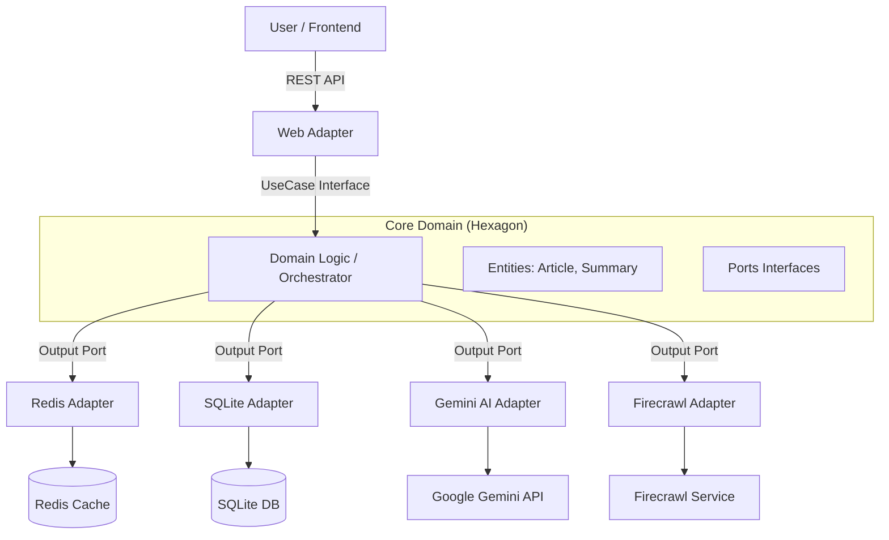

# Summarize-with-AI 🤖📰

> **Hệ thống tóm tắt tin tức tự động sử dụng AI (Gemini), Kiến trúc Hexagonal và Redis High-Performance.**

   

## 📖 Giới Thiệu

**Summarize-with-AI** là giải pháp giúp người dùng cập nhật tin tức công nghệ nhanh chóng mà không cần đọc hết các bài báo dài. Hệ thống tự động thu thập tin tức từ Techmeme, sử dụng **Firecrawl** để lấy nội dung chi tiết và **Google Gemini AI** để tóm tắt thành các gạch đầu dòng súc tích bằng tiếng Việt.

Dự án này là minh chứng cho việc áp dụng **Kiến trúc Hexagonal (Ports & Adapters)** kết hợp với các kỹ thuật tối ưu hiệu năng cao cấp như **Virtual Threads**, **Distributed Locking**, và **Async Processing**.

---

## 🚀 Tính Năng Nổi Bật

*   **Tóm tắt thông minh:** Sử dụng Google Gemini 1.5 Flash để phân tích và tóm tắt nội dung.
*   **Hiệu năng cực cao:** Phản hồi người dùng < 5ms nhờ chiến lược Caching nhiều lớp (L1 Caffeine, L2 Redis).
*   **Cơ chế chống lỗi (Fault Tolerance):** Tự động Retry, Circuit Breaker khi API bên thứ 3 gặp sự cố.
*   **Xử lý bất đồng bộ:** Tác vụ nặng chạy ngầm, không làm treo giao diện người dùng.
*   **Rate Limiting thông minh:** Tự động điều chỉnh tốc độ gọi API để tránh lỗi 429 (Too Many Requests).

---

## 🏗️ Kiến Trúc Hệ Thống

Hệ thống tuân thủ nghiêm ngặt **Hexagonal Architecture**:



### Các Design Pattern Đã Áp Dụng
1.  **Adapter Pattern:** Kết nối các dịch vụ bên ngoài (Gemini, Firecrawl) vào hệ thống lõi.
2.  **Strategy Pattern:** Chuyển đổi linh hoạt giữa chế độ `Real` và `Mock` AI.
3.  **Decorator/Proxy Pattern:** Sử dụng cho Caching và Transaction Management.
4.  **Observer/Event-Driven:** Xử lý luồng Refresh bất đồng bộ.
5.  **Circuit Breaker:** Ngắt kết nối khi AI API bị lỗi liên tục.

---

## 🛠️ Cài Đặt & Chạy Dự Án

### Yêu Cầu
*   Java 21+
*   Node.js 18+
*   Redis (Chạy local hoặc Docker)
*   API Key: Google Gemini & Firecrawl

### 1. Backend (Spring Boot)
```bash
cd backend
# Cấu hình API Key trong application.properties hoặc biến môi trường
./mvnw spring-boot:run
```

### 2. Frontend (React + Vite)
```bash
cd frontend
npm install
npm run dev
```

---

## 📊 Báo Cáo Hiệu Năng

So sánh giữa phiên bản cũ (Sync) và phiên bản mới (Async + Redis):

| Metric | Legacy (Sync) | Optimized (Async) | Cải thiện |
| :--- | :--- | :--- | :--- |
| **Avg Latency (Write)** | 932 ms | **2.2 ms** | ⚡ **421x** |
| **Max Latency** | 31,000 ms | **9 ms** | ✅ **No Timeout** |
| **Throughput** | 18 req/s | **54 req/s** | 🔥 **3x** |

> *Xem chi tiết tại file `ARCHITECTURE_REPORT.md`*

---

## 📂 Cấu Trúc Dự Án

```
Summarize-with-AI/
├── backend/
│   ├── src/main/java/com/example/summarizer/
│   │   ├── domain/          # Core Business Logic (Entities)
│   │   ├── ports/           # Interfaces (Input/Output Ports)
│   │   ├── service/         # UseCase Implementations (Orchestrator)
│   │   ├── adapters/        # Implementations of Ports
│   │   ├── clients/         # External API Clients (Gemini, Firecrawl)
│   │   ├── config/          # Spring Configuration (Redis, Async)
│   │   └── controller/      # REST API Endpoints
│   └── report/              # Báo cáo hiệu năng (k6 results)
├── frontend/
│   ├── src/components/      # React Components
│   └── src/services/        # API Integration
└── ARCHITECTURE_REPORT.md   # Báo cáo chi tiết hệ thống
```

---
**Author:** Toilathuc & GitHub Copilot

### **3. Chạy Backend**
```bash
cd backend
./mvnw spring-boot:run
```
_Server khởi động tại [`http://localhost:8080`](http://localhost:8080)_

### **4. Chạy Frontend**
```bash
cd frontend
npm install
npm run dev
```
_Truy cập ứng dụng tại [`http://localhost:5173`](http://localhost:5173)_

---

## 🔌 API Documentation

| Method | Endpoint            | Mô tả                                        |
|--------|---------------------|----------------------------------------------|
| GET    | `/api/news`         | Lấy danh sách tin đã tóm tắt (cache)         |
| POST   | `/api/news/refresh` | Kích hoạt làm mới tin tức (xử lý async)      |
| GET    | `/api/news/status`  | Kiểm tra trạng thái tiến trình refresh       |

---

## 📊 Hiệu năng (Performance)

Kiểm thử tải bằng **k6** (100 Virtual Users):

| Kịch bản   | Latency (Avg) | RPS | Kết quả                                          |
|------------|---------------|-----|--------------------------------------------------|
| Đọc        | ~2.78 ms      |  55 | Phản hồi tức thì nhờ cache Redis                  |
| Ghi/Refresh| ~2.21 ms      |  55 | Async API, không block request                    |
| Hỗn hợp    | ~2.47 ms      | 110 | Hệ thống hoàn toàn ổn định                       |

_💡 Phiên bản async mới nhanh hơn **400 lần** so với bản sync cũ khi xử lý nặng._

---

## 📂 Cấu trúc thư mục

```bash
Summarize-with-AI/
├── backend/                # Spring Boot app
│   ├── src/main/java/      # Source code (hexagonal)
│   ├── report/             # Báo cáo hiệu năng (k6)
│   └── ...
├── frontend/               # Ứng dụng React
│   ├── src/                # React components & hooks
│   └── ...
├── java-spring/            # Bản cũ (legacy, tham khảo)
└── README.md               # Tài liệu dự án
```

---

## 📝 License

Dự án tạo ra phục vụ mục đích học tập và nghiên cứu, không dùng thương mại.
