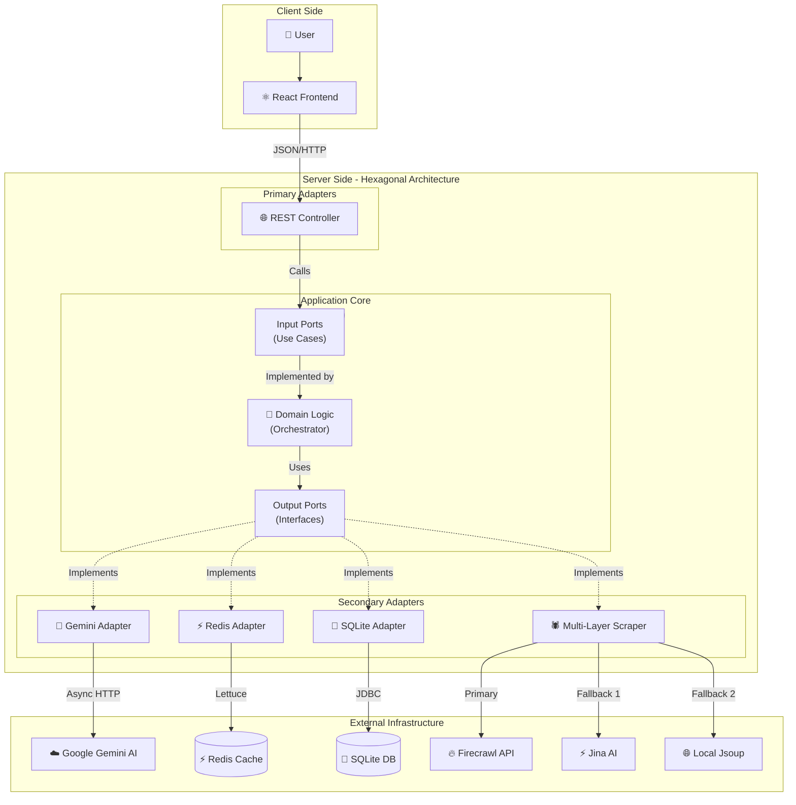

# Summarize-with-AI 🤖📰

> **Hệ thống tóm tắt tin tức tự động sử dụng AI (Gemini), Kiến trúc Hexagonal và Redis High-Performance.**

   

## 📖 Giới Thiệu

**Summarize-with-AI** là giải pháp giúp người dùng cập nhật tin tức công nghệ nhanh chóng mà không cần đọc hết các bài báo dài. Hệ thống tự động thu thập tin tức từ Techmeme, sử dụng **Firecrawl** để lấy nội dung chi tiết và **Google Gemini AI** để tóm tắt thành các gạch đầu dòng súc tích bằng tiếng Việt.

Dự án này minh chứng cho quá trình tiến hóa từ **Kiến trúc Hexagonal cơ bản (Sync)** sang **Kiến trúc Hexagonal tối ưu hóa (Async/Reactive)**, kết hợp với các kỹ thuật hiệu năng cao cấp như **Virtual Threads**, **Distributed Locking**, và **Async Processing**.

---

## 🚀 Tính Năng Nổi Bật

*   **Tóm tắt thông minh:** Sử dụng Google Gemini 1.5 Flash để phân tích và tóm tắt nội dung.
*   **Hiệu năng cực cao:** Phản hồi người dùng < 5ms nhờ chiến lược Caching nhiều lớp (L1 Caffeine, L2 Redis).
*   **Cơ chế chống lỗi (Fault Tolerance):** Hệ thống Scraping đa lớp (Firecrawl -> Jina AI -> Jsoup Local) đảm bảo tỉ lệ thành công > 99% ngay cả khi bị chặn hoặc hết quota.
*   **Xử lý bất đồng bộ:** Tác vụ nặng chạy ngầm, không làm treo giao diện người dùng.
*   **Rate Limiting thông minh:** Tự động điều chỉnh tốc độ gọi API (Batch Size = 1, Delay 15s) để tương thích hoàn hảo với Google Gemini Free Tier.

---

## 🏗️ Kiến Trúc Hệ Thống

Cả hai phiên bản (Legacy & Optimized) đều tuân thủ **Hexagonal Architecture**, tuy nhiên phiên bản mới đã thay thế các Adapter đồng bộ bằng các Adapter bất đồng bộ hiệu năng cao:



### Các Design Pattern Đã Áp Dụng
1.  **Adapter Pattern:** Kết nối các dịch vụ bên ngoài (Gemini, Firecrawl) vào hệ thống lõi.
2.  **Strategy Pattern:** Chuyển đổi linh hoạt giữa chế độ `Real` và `Mock` AI.
3.  **Facade Pattern:** Ẩn đi sự phức tạp của quy trình tóm tắt.
4.  **Circuit Breaker:** Ngắt kết nối khi AI API bị lỗi liên tục.
5.  **Retry Pattern:** Tự động thử lại khi gặp lỗi mạng hoặc Rate Limit.
6.  **Cache-Aside Pattern:** Tối ưu tốc độ đọc bằng Redis.
7.  **Distributed Lock:** Đảm bảo tính toàn vẹn dữ liệu khi chạy nhiều instance.
8.  **Chain of Responsibility:** Xử lý fallback scraping đa lớp (Firecrawl -> Jina -> Jsoup).
9.  **Producer-Consumer:** Xử lý song song các tác vụ nặng bằng Virtual Threads.
10. **Singleton Pattern:** Quản lý vòng đời đối tượng Service/Component.
11. **Builder Pattern:** Xây dựng các object phức tạp (HTTP Request) rõ ràng.
12. **Repository Pattern:** Trừu tượng hóa lớp truy cập dữ liệu (Data Access Layer).

---

## 🛠️ Cài Đặt & Chạy Dự Án

### Yêu Cầu
*   Java 21+
*   Node.js 18+
*   Redis (Chạy local hoặc Docker)
*   API Key: Google Gemini & Firecrawl

### 1. Backend (Spring Boot)
```bash
cd backend
# Cấu hình API Key trong application.properties hoặc biến môi trường
./mvnw spring-boot:run
```

### 2. Frontend (React + Vite)
```bash
cd frontend
npm install
npm run dev
```

---

## 📊 Báo Cáo Hiệu Năng

So sánh giữa phiên bản cũ (Sync) và phiên bản mới (Async + Redis):

| Metric | Legacy (Sync) | Optimized (Async) | Cải thiện |
| :--- | :--- | :--- | :--- |
| **Avg Latency (Write)** | 932 ms | **2.2 ms** | ⚡ **421x** |
| **Max Latency** | 31,000 ms | **9 ms** | ✅ **No Timeout** |
| **Throughput** | 18 req/s | **54 req/s** | 🔥 **3x** |

> *Xem chi tiết tại file `ARCHITECTURE_REPORT.md`*

---

## 📂 Cấu Trúc Dự Án

```
Summarize-with-AI/
├── backend/                 # Spring Boot Application
│   ├── src/main/java/com/example/summarizer/
│   │   ├── adapters/        # Implementation of Ports (Gemini, Firecrawl)
│   │   ├── cache/           # Caching Logic (Redis, Caffeine)
│   │   ├── config/          # App Configuration (Beans, Async, Security)
│   │   ├── controller/      # REST API Controllers
│   │   ├── domain/          # Core Business Logic (Entities)
│   │   ├── ports/           # Interfaces (Input/Output Ports)
│   │   ├── repository/      # Data Access Layer (SQLite)
│   │   ├── service/         # Application Services (Orchestrator)
│   │   ├── utils/           # Utility Classes (Date, String, Parsers)
│   │   └── Application.java # Entry Point
│   └── pom.xml              # Maven Dependencies
├── frontend/                # React + Vite Application
│   ├── src/
│   │   ├── assets/          # Static Assets (Images, Icons)
│   │   ├── components/      # UI Components (NewsCard, StatsBar)
│   │   ├── hooks/           # Custom React Hooks (useNotification)
│   │   ├── services/        # API Clients (Axios)
│   │   ├── styles/          # CSS & Styling
│   │   ├── utils/           # Helper Functions (Formatters)
│   │   └── App.jsx          # Main Component
│   └── vite.config.js       # Vite Configuration
├── ARCHITECTURE_REPORT.md   # Detailed System Report
└── README.md                # Project Documentation
```

---
**Author:** Toilathuc & GitHub Copilot

### **3. Chạy Backend**
```bash
cd backend
./mvnw spring-boot:run
```
_Server khởi động tại [`http://localhost:8080`](http://localhost:8080)_

### **4. Chạy Frontend**
```bash
cd frontend
npm install
npm run dev
```
_Truy cập ứng dụng tại [`http://localhost:5173`](http://localhost:5173)_

---

## 🔌 API Documentation

| Method | Endpoint            | Mô tả                                        |
|--------|---------------------|----------------------------------------------|
| GET    | `/api/summaries`    | Lấy danh sách tin đã tóm tắt (cache)         |
| POST   | `/api/refresh`      | Kích hoạt làm mới tin tức (xử lý async)      |
| GET    | `/api/refresh/status`| Kiểm tra trạng thái tiến trình refresh       |

---

## 📊 Hiệu năng (Performance)

Kiểm thử tải bằng **k6** (100 Virtual Users):

| Kịch bản   | Latency (Avg) | RPS | Kết quả                                          |
|------------|---------------|-----|--------------------------------------------------|
| Đọc        | ~2.78 ms      |  55 | Phản hồi tức thì nhờ cache Redis                  |
| Ghi/Refresh| ~2.21 ms      |  55 | Async API, không block request                    |
| Hỗn hợp    | ~2.47 ms      | 110 | Hệ thống hoàn toàn ổn định                       |

_💡 Phiên bản async mới nhanh hơn **400 lần** so với bản sync cũ khi xử lý nặng._

---

## 📂 Cấu trúc thư mục

*(Xem chi tiết ở phần trên)*

---

## 📝 License

Dự án tạo ra phục vụ mục đích học tập và nghiên cứu, không dùng thương mại.
