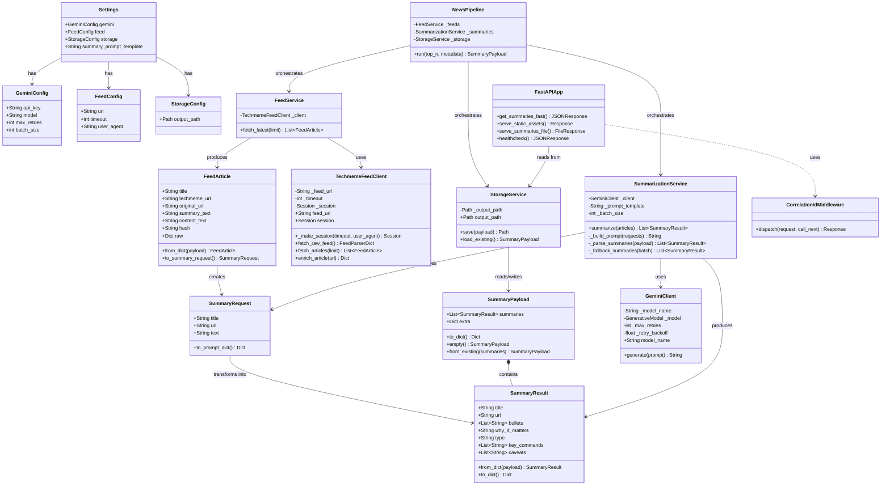
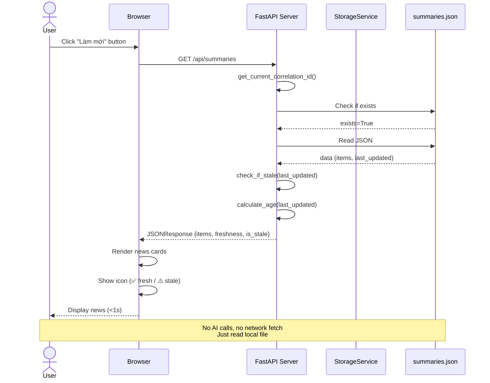
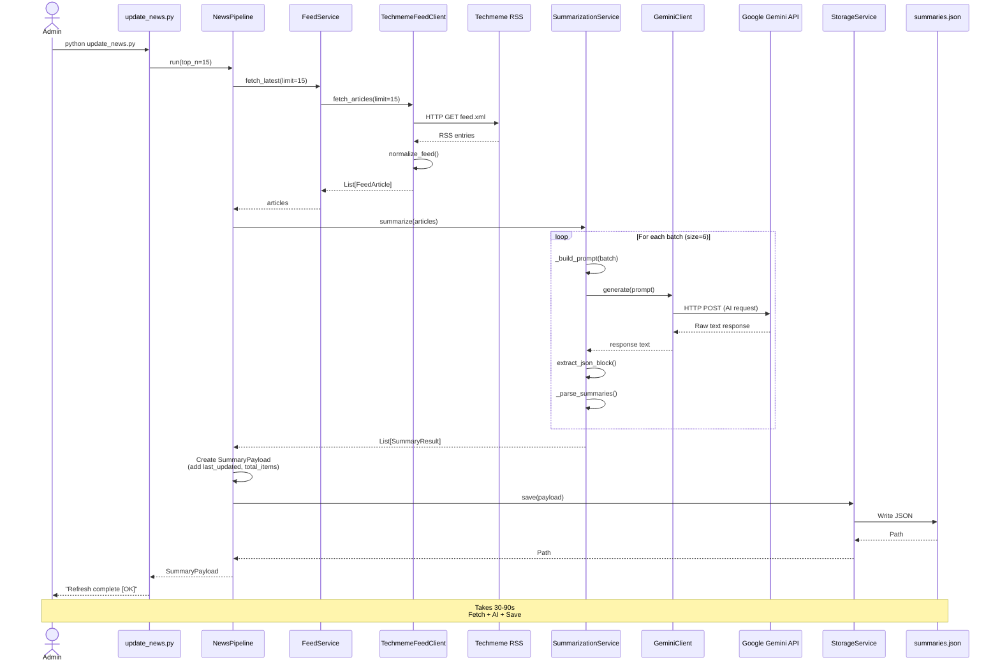
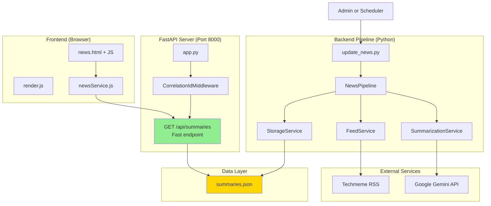

# ARCHITECTURE DIAGRAMS - Summarize-with-AI

This document visualizes the class structure and operational flows using Mermaid diagrams.

**How to view:**

- In VS Code: Install extension "Markdown Preview Mermaid Support" or "Mermaid Preview"
- On GitHub: Mermaid is natively rendered in markdown

---

> **Status (Oct 2025):** The historical `/api/refresh` + `/api/refresh/status` endpoints were removed. Admins now run `python update_news.py` (or `update_news.bat`) to regenerate `summaries.json`, and the UI always reloads via the fast `/api/summaries` endpoint.

## 1. Class Diagram (Core Domain & Services)

---

## 2. Sequence Diagram - Fast Flow (User Refresh)

---

## 3. Sequence Diagram - Slow Flow (Admin Update)

---

## 4. Sequence Diagram - Background Refresh (legacy, removed)

The HTTP-triggered background job (`/api/refresh` + `/api/refresh/status`) has been retired. Use the CLI-based flow in section 3 whenever you need fresh data. If you must reintroduce an HTTP trigger, wrap `update_news.py` behind an authenticated admin endpoint and queue the work instead of spawning a long-running request.

---

## 5. Component Architecture Overview

---

## Usage Guide

### View in VS Code

1. Install extension: "Markdown Preview Mermaid Support"
2. Open this file
3. Press `Ctrl+Shift+V` (preview) or right-click → "Open Preview"

### Export as Image

1. Use VS Code extension "Mermaid Markdown Syntax Highlighting" with export feature
2. Or use online tool: https://mermaid.live
3. Copy diagram code → paste → export PNG/SVG

### Customize

- Edit diagram code directly in this markdown file
- Syntax guide: https://mermaid.js.org/intro/

---

Generated: 2025-10-22
